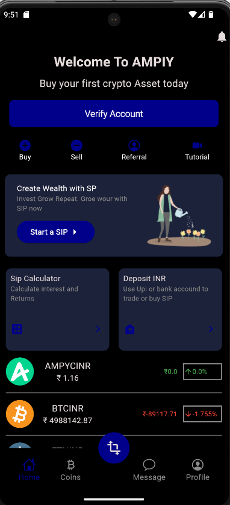

# 📈 Cryptocurrency Status App

A Flutter application that connects to a WebSocket API to display real-time cryptocurrency prices. The app uses the BLoC Cubit for efficient state management and follows the MVC architecture to ensure clean and maintainable code.

## 🚀 Features

- **Real-time Cryptocurrency Prices:** Get the latest prices and updates for various cryptocurrencies.
- **WebSocket Integration:** Efficient real-time data fetching using WebSocket.
- **BLoC Cubit for State Management:** Simplified and powerful state management using BLoC Cubit.
- **Search Functionality:** Quickly search cryptocurrencies by code.
- **Clean and Maintainable Architecture:** Follows MVC architecture for separation of concerns.

## 📱 Screenshots

### Home Screen


### Crypto List


## 🛠️ Installation

To run this project, follow these steps:

1. **Clone the repository:**
   ```bash
   git clone https://github.com/YourUsername/crypto_app.git
   cd crypto_app
   flutter pub get
   flutter run


🧩 Architecture
This project follows the MVC (Model-View-Controller) architecture, ensuring a clear separation of concerns:

Model: Handles data and business logic.
View: Displays data to the user.
Controller: Manages user input and updates the view.
State management is handled using BLoC Cubit, which provides a streamlined way to manage state across the app.

📡 WebSocket Integration
## The app connects to the WebSocket API to fetch real-time cryptocurrency prices:

## WebSocket URL: ws://prereg.ex.api.ampiy.com/prices
## Subscription Message:
{
  "method": "SUBSCRIBE",
  "params": ["all@ticker"],
  "cid": 1
}
